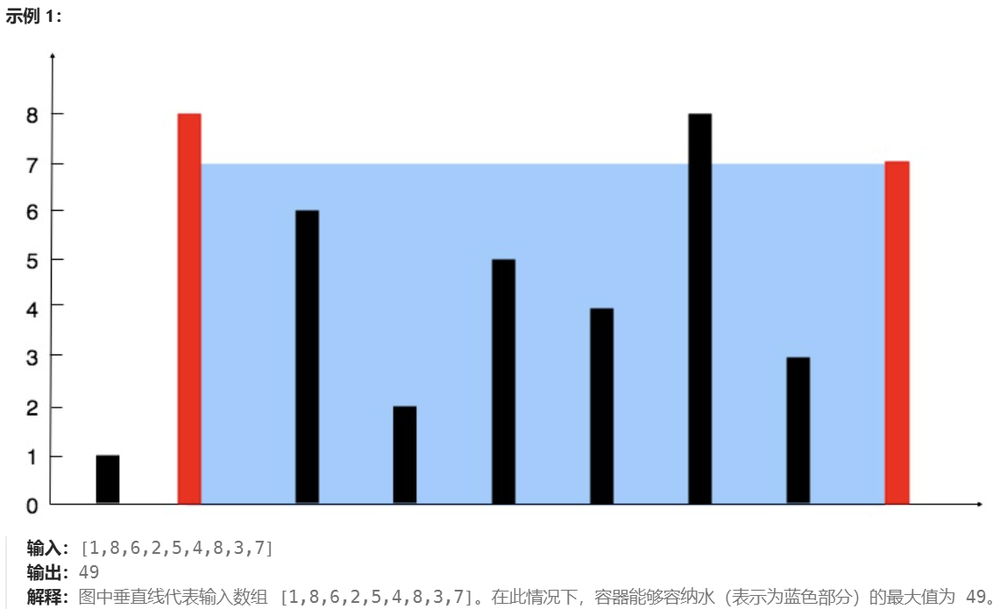
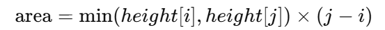

### 1.两数之和
**题目大意：**
```angular2html
在数组中找到和为目标值的两个整数对应下标
```
**解题思路：**
```angular2html
暴力枚举法
两个for循环
从第一个元素，依次往后相加看结果
从第二个元素，依次往后相加看结果
。。。
```
**时间复杂度分析：**
```angular2html
时间复杂度：o(n^2)
空间复杂度：o(1)
```
**完整代码：**
```angular2html
 def twoSum(self, nums: List[int], target: int) -> List[int]:
        n = len(nums)
        for i in range(n):
            for j in range(i + 1, n):
                if nums[i] + nums[j] == target:
                    return [i, j]
        
        return []
```

### 49.字母异位词分组
**题目大意：**
```angular2html
将一个字符串数组中，相同字母元素不同顺序的字符串组合在一起，成为新的数组输出
```
**解题思路：**
```angular2html
排序、哈希表  
字母异位词在排序后拼接，都成为相同的字符串
将排序后的字符串作为key，相应字母异位词都为其value
最终，哈希表的每个value都是一组字母异位词
```
**时间复杂度分析：**
```angular2html
时间复杂度：O(nklogk)，其中 n 是 strs 中的字符串的数量，k 是 strs 中的字符串的的最大长度。需要遍历 n 个字符串，对于每个字符串，需要 O(klogk) 的时间进行排序以及 O(1) 的时间更新哈希表

空间复杂度：O(nk)，其中 n 是 strs 中的字符串的数量，k 是 strs 中的字符串的的最大长度。需要用哈希表存储全部字符串。
```
**完整代码：**
```angular2html
def groupAnagrams(self, strs:List[str]) -> List[List[str]]:
    mp = collections.defaultdict(list)  # 创建一个默认字典，默认值是 list 类型

    for st in strs:
        key = "".join(sort(st))  # 用排序后（空字符）拼接的字符串作为key
        mp[key].append(st)  # 将该字符串加入这个key对应的value数组中
    
    return list(mp.values())  # 返回字典中所有值的列表
```

### 128.最长连续序列
**题目大意：**
```angular2html
给定一个未排序的整数数组 nums ，找出数字连续的最长序列（不要求序列元素在原数组中连续）的长度。

请你设计并实现时间复杂度为 O(n) 的算法解决此问题。
```
**解题思路：**
```angular2html
用集合存储数组中的所有元素，然后利用这些元素来构建连续的整数序列
集合：是基于哈希表的一种抽象数据类型，它存储的只是元素（而不是键值对），并且保证元素唯一（自动去重）。
Steps:
1.将所有数字存储在一个集合nums_set中
2.遍历每一个数字，判断是否为一个新连续序列的开始（即num-1不在集合中）
3.对于每一个序列的起始数字，向右扩展查找连续数字，直到不能再扩展为止。
4.返回找到的最长序列长度
```
**时间复杂度分析：**
```angular2html
将所有元素插入到集合中需要 O(n) 时间，其中 n 是数组的大小。
遍历每个元素时，对于每个元素 x，我们只会在它是连续序列的起始元素时遍历它的序列部分。由于每个元素最多只会被访问一次，因此整个过程的时间复杂度是 O(n)。
```
**完整代码：**
```angular2html
def longestConsecutive(self, nums:List[int]) -> int:
    # 如果nums为空，直接返回0
    if not nums:
        return 0
    
    # 将所有元素放入集合(无序 且 不重复 )中
    nums_set = set(nums)  # 将数组转换为集合（同时去除了重复元素）
    max_length = 0
    
    # 遍历每个元素
    for num in nums_set:
        # 只有在num-1不在集合中的时候，num才可能是一个序列的起始点
        if num-1 not in nums_set:
            current_num = num
            current_length = 1
            
            # 向右扩展序列
            while current_num + 1 in nums_set:
                current_num += 1
                current_length += 1
            
            # 更新最长序列长度
            max_length = max(max_length, current_length)
    return max_length
```

### 283.移动零
**题目大意：**
```angular2html
给定一个数组 nums，编写一个函数将所有 0 移动到数组的末尾，同时保持非零元素的相对顺序。

请注意 ，必须在不复制数组的情况下原地对数组进行操作。
```
**解题思路：**
```angular2html
双指针：使用两个指针 left 和 right，其中：
    left 指针指向下一个应该放置非零元素的位置。
    right 指针遍历整个数组，寻找非零元素。
Steps:
1.初始化指针：初始化 left 为 0，right 为 0。left 用来标记下一个非零元素应放置的位置。
2.遍历数组：
    如果 nums[right] 是非零元素，将其放置到 nums[left] 位置，然后更新 left 指针，指向下一个位置。
    遇到零元素时，不做处理，继续遍历。
3.遍历结束后，left 之后的位置将是零元素，非零元素已经被移到了数组前面。
```
**时间复杂度分析：**
```angular2html
时间复杂度：O(n)，其中 n 是数组的长度。我们只遍历了一次数组，并且每次交换操作的时间复杂度为 O(1)。
空间复杂度：O(1)，我们只使用了常数的空间（两个指针 left 和 right）。
```
**完整代码：**
```angular2html
def moveZeroes(self, nums:List[int]) -> None:
    n = len(nums)
    left = right = 0  # 初始化两个指针，left 指向下一个非零元素应该存放的位置，right 用来遍历整个数组
    
    # 遍历数组
    while right < n:
        # 如果当前元素非0
        if nums[right] != 0:    
            # 将其与 left 指向的元素交换
            nums[left], nums[right] = nums[right], nums[left]  
            left += 1  # 更新left指针，指向下一个非0元素的位置
        right += 1  # 遍历下一个元素
```

### 11.盛最多水的容器
**题目大意：**
```angular2html
给定一个长度为 n 的整数数组 height 。有 n 条垂线，第 i 条线的两个端点是 (i, 0) 和 (i, height[i]) 。

找出其中的两条线，使得它们与 x 轴共同构成的容器可以容纳最多的水。

返回容器可以储存的最大水量。
```

**解题思路：**

对于任意两条线，假设它们位于索引 i 和 j，且 i < j，那么容器的面积计算公式为：



```angular2html
两种思路：
暴力法：直接两两组合，计算所有可能面积，找出最大那个。时间复杂度o(n^2)

双指针法（用这个）：
初始时，指针分别指向数组的两端。然后，计算两端的面积，更新最大面积，并根据情况移动指针。
由于较短的线段决定了容器的高度，所以每次移动指针时，都应该移动较短的那一边的指针。
Steps:
1.初始化：指针 left 和 right 分别指向数组的两端。
2.计算面积：根据公式 min(height[left], height[right]) * (right - left) 计算当前的面积。
3.更新最大面积：将计算出的面积与当前最大面积进行比较，更新最大面积。
4.移动指针：每次移动较短的那一边的指针，这样做是因为面积是由较短的线决定的
5.终止条件：当 left 和 right 相遇时，结束循环。
```
**时间复杂度分析：**
```angular2html
时间复杂度：O(n)，其中 n 是数组的长度。我们只需要一次遍历，指针分别从两端向中间移动，因此时间复杂度为线性。
空间复杂度：O(1)，我们只使用了常数空间来存储指针和最大面积。
```
**完整代码：**
```angular2html
def maxArea(self, height:List[int]) -> int:
    # 初始化左右指针和最大面积
    left, right = 0, len(height)-1
    max_area = 0

    # 当左右指针不重合时
    while left < right:
        # 计算当前容器面积
        width = right - left
        height_min = min(height[left], height[right])
        max_area = max(max_area, width * height_min)

        # 移动较矮的那条线的指针
        if height[left] < height[right]:
            left += 1
        else:
            right -= 1
    
    return max_area
```