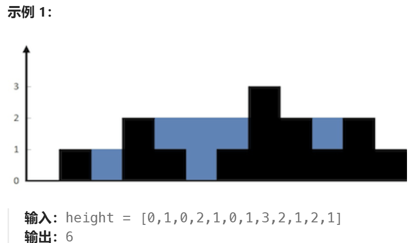

### 15.三数之和
**题目大意：**
```angular2html
给你一个整数数组 nums ，判断是否存在三元组 [nums[i], nums[j], nums[k]] 满足 i != j、i != k 且 j != k ，同时还满足 nums[i] + nums[j] + nums[k] == 0 。请你返回所有和为 0 且不重复的三元组。

注意：答案中不可以包含重复的三元组。
```
**解题思路：**
```angular2html
1.排序
2.固定一个元素num[i]，在剩下部分中找两个数和等于-num[i]
3.双指针：
    对于每个固定的元素 nums[i]，我们使用两个指针来在剩下的数组中查找两个数。left 指针从 i + 1 开始，right 指针从数组的末尾开始。
    如果 nums[left] + nums[right] == -nums[i]，那么我们找到了一个三元组，记录下来，并且移动两个指针，跳过重复的元素。
    如果 nums[left] + nums[right] < -nums[i]，则说明左指针指向的数太小，需要增大 left。
    如果 nums[left] + nums[right] > -nums[i]，则说明右指针指向的数太大，需要减小 right。
4.跳过重复元素
```
**时间复杂度分析：**
```angular2html
时间复杂度：排序的时间复杂度是 O(nlogn)。对于每个元素 nums[i]，使用双指针遍历剩下的部分，时间复杂度是 O(n^2)。因此，整体的时间复杂度是 O(n^2)。
空间复杂度：我们只使用了额外的 result 列表来存储结果，空间复杂度是 O(n)，其中 n 是结果中三元组的数量。
```
**完整代码：**
```angular2html
def threeSum(nums:List[int]) -> List[List[int]]:
    # 结果列表
    result = []

    # 排序
    nums.sort()

    # 遍历每个数(依次固定一个数字，往后找和为其相反数的俩数字)
    for i in range(len(nums) - 2):
        # 跳过重复元素
        if i > 0 and nums[i] == nums[i-1]:
            continue

        # 使用双指针寻找和为0的三元数组
        left, right = i + 1, len(nums) - 1
        while left < right:
            total = nums[i] + nums[left] + nums[right]
            if total == 0:
                result.append([nums[i], nums[left], nums[right]])
                
                # 跳过重复元素
                while left < right and nums[left] == nums[left + 1]:
                    left += 1
                while left < right and nums[right] == nums[right - 1]:
                    right -= 1
                
                # 移动指针
                left += 1
                right -= 1
            elif total < 0:
                left += 1
            else:
                right -= 1

    return result
```

### 42.接雨水
**题目大意：**
```angular2html
给定 n 个非负整数表示每个宽度为 1 的柱子的高度图，计算按此排列的柱子，下雨之后能接多少雨水。
```


**解题思路：**
```angular2html
题目分析：
给定一个数组height，每个元素表示一个柱子高度，柱子宽度为1。
1.每个位置i的水量由左右两边的最大高度决定
    max_left[i] 为位置 i 左边（包括位置 i）的最大柱子高度。
    max_right[i] 为位置 i 右边（包括位置 i）的最大柱子高度。
    位置i接水量计算公式：water[i]=max(min(max_left[i],max_right[i])−height[i],0)
（Key：也就是说，当前位置 i 的水量是其左右最大高度的最小值减去当前位置的高度。如果结果为负，则没有水。）
2.双指针
    left 和 right 分别指向数组的两端。
    left_max 和 right_max 分别记录左右两边的最大高度。

Steps:
    1.双指针遍历每一步，判断height[left]和height[right]的大小
    2.如果 height[left] 小于 height[right]，从左边开始处理。（反之从右边开始，做法同理）
    此时，如果 height[left] 大于等于 left_max，则更新 left_max，否则计算当前能接的水量，并将指针向右移动。
    3.当left和right相遇时，遍历结束
```
**时间复杂度分析：**
```angular2html
时间复杂度：O(n)，只遍历了数组一次。
空间复杂度：O(1)，只使用了常数的空间来存储一些变量。
```
**完整代码：**
```angular2html
def trap(height):
    # 如果输入的数组为空，直接返回0，因为没有柱子可以储水
    if not height:
        return 0
    
    n = len(height)
    # 初始化
    left, right = 0, n-1  # 初始化指针
    left_max, right_max = height[left], height[right]  # 初始化左侧的最大高度 `left_max` 和右侧的最大高度 `right_max`
    total_water = 0  # 用来存储总共能够接到的水量
    
    # 双指针遍历，直到 `left` 和 `right` 重合
    while left < right:
        # 若当前左边较小，则从左边开始处理
        if height[left] < height[left]:  
            # 如果当前左边的高度大于等于当前的最大左边高度，则更新左边的最大高度
            if height[left] >= left_max:  
                left_max = height[left]
            else:
                # 否则，当前左边位置的高度小于 `left_max`，说明可以接水
                # 当前接的水量为：`left_max - height[left]`
                total_water += left_max - height[left]
            # 将左指针右移一位
            left += 1
        
        else:
            # 如果右边的高度小于等于左边的高度，处理右边的指针
            # 如果当前右边的高度大于等于当前的最大右边高度，则更新右边的最大高度
            if height[right] >= right_max:
                right_max = height[right]
            else:
                # 否则，当前右边位置的高度小于 `right_max`，说明可以接水
                # 当前接的水量为：`right_max - height[right]`
                total_water += right_max - height[right]
            # 将右指针左移一位
            right -= 1
    
    # 返回计算得到的总水量
    return total_water
```     

### 3.无重复字符串的最长子串
**题目大意：**
```angular2html
给定一个字符串s，请你找出其中不含有重复字符的最长子串的长度。
```
**解题思路：**
```angular2html
‘子串’-----滑动窗口（双指针）
哈希集合（这里用它是因为哈希查找和插入元素的时间为o(1)）
Steps:
    1.使用滑动窗口：用两个指针left和right来表示当前窗口的范围。right从左到右逐个遍历字符串，left用来缩小窗口。
    2.使用哈希集合：通过一个哈希集合（set）来记录当前窗口内的字符。每次移动 right 指针时，检查字符是否已经存在于集合中。如果字符已经存在，移动 left 指针直到窗口中没有重复字符。
    3.计算最长子串的长度：每次移动 right 指针时，更新窗口的大小，并记录最长的子串长度。
```
**时间复杂度分析：**
```angular2html
时间复杂度：O(n)，其中 n 是字符串 s 的长度。left 和 right 都最多遍历一遍字符串，每个字符最多加入和移出哈希集合一次，所以总体时间复杂度是线性的。
空间复杂度：O(min(n, m))，其中 n 是字符串的长度，m 是字符集的大小（比如，ASCII 码下是 128，或者是 Unicode 字符集的大小）。在最坏情况下，哈希集合可能存储所有的字符。
```
**完整代码：**
```angular2html
def lengthOfLongestSubstring(s:str) -> int:
    char_set = set()  # 创建一个集合用于存储当前窗口字符
    left = 0  # 窗口左边界
    right = 0  # 窗口右边界
    max_len = 0  # 记录子串

    for right in range(len(s)):
        # 如果字符已经在当前窗口内，移动左边界
        while s[right] in char_set:   #(哈希查找和插入元素的时间为o(1)，这也是为什么没有用数组之类的)
            char_set.remove(s[left])
            left += 1

        # 将当前字符添加到窗口中
        char_set.add(s[right])

        # 更新最大长度
        max_len = max(max_len, right - left + 1)

    return max_len
```   

### 438.找到字符串中所有字母异位词
**题目大意：**
```angular2html
给定两个字符串s和p，找到s中所有p的异位词的子串，返回这些子串的起始索引。不考虑答案输出的顺序。
```
**解题思路：**
```angular2html
‘子串’-----滑动窗口（窗口大小固定==p的长度）
(mine)法一：含排序（sorted(p)）
Steps:
    1.使用滑动窗口：使用一个长度为 len(p) 的滑动窗口在 s 中移动。
    2.对窗口内容排序，如果等于排序后的p，那么为p的异位词，记录当前窗口起始索引
    3.依次滑动至遍历结束
法二：
字符频率统计：统计滑动窗口中的字符频率。如果窗口子串的26个字符频率==p的26个字符频率，那么说明是字母异位词。


Steps:使用字符计数（Counter）
    1.分别用s_count和p_count存储26个字符频率。
    2.使用一个长度为len(p)的滑动窗口在s中移动。对于每个滑动窗口，检查窗口中的字符是否和p中的字符频率相同。
    3.依次滑动至遍历结束
```
**时间复杂度分析：**
```angular2html
法一：
时间复杂度：O(n * m log m)，其中n是字符串s的长度，m是字符串p的长度。
空间复杂度： O(n + m)，其中 n 是字符串s的长度，m是字符串p的长度。

法二：
时间复杂度：O(n)，其中 n 是字符串 s 的长度。我们只遍历字符串 s 一次，并且每次操作是常数时间的（更新哈希表）。
空间复杂度：O(1)，即空间复杂度是常数，因为我们使用的哈希表大小是固定的（26个字母）。
```
**完整代码：**
法一：
```angular2html
def findAnagrams(self, s:str, p:str) -> List[int]:
    # 定义窗口大小（通过left遍历位置）
    window_size = len(p)
    left = 0
    index = []  # 存储各起始索引
    sorted_p = sorted(p)  # 排序后的p（注意：sorted(p)不会改变p，会返回排序后的对象。 而p.sort()是对原p进行改变，不返回返回对象）

    # 滑动窗口遍历
    for left in range(len(s) - window_size + 1):
        if sorted(s[left:left+window_size]) == sorted_p:
            index.append(left)
    return index
```   
法二：
```angular2html
def findAnagrams(self, s:str, p:str) -> List[int]:
    s_len, p_len = len(s), len(p)
   
    # 如果 s 的长度小于 p 的长度，s 不可能包含 p 的异位词
    if s_len < p_len:
        return []

    ans = []  # 存储异位词的起始索引
    s_count = [0] * 26  # 用于统计 s 中字符的频率，大小为 26 对应 26 个字母（索引0、1、2...依次代表字母a, b, c, ...）
    p_count = [0] * 26  #  用于统计 p 中字符的频率

    # 初始窗口检查(s中的前p_len个字符 & p)
    # 统计s, p中每个字符的频率（ord('a') = 97）
    for i in range(p_len):
        s_count[ord(s[i]) - 97] += 1  
        p_count[ord(s[i]) - 97] += 1
    # 若 s 中的前 p_len 个字符和 p 的字符频率相同，则是一个异位词
    if s_count == p_count:
        ans.append(0)  # 如果是异位词，记录下起始索引 0

    # 开始滑动窗口，遍历 s 中每一个子串，窗口大小为 p_len
    for i in range(s_len - p_len):
        # 移除窗口最左边字符的计数（相当于滑动窗口左移）
        s_count[ord(s[i]) - 97] -= 1
        
        # 将窗口右边新加入的字符的计数加 1
        s_count[ord(s[i + p_len]) - 97] += 1
        
        # 如果当前窗口的字符频率和 p 的字符频率相同，则说明当前窗口是 p 的异位词
        if s_count == p_count:
            ans.append(i + 1)  # 记录当前窗口的起始索引，索引从 i + 1 开始

    return ans  # 返回所有找到的异位词的起始索引
```

### 560.和为K的子数组
**题目大意：**
```angular2html
给你一个整数数组nums和一个整数k，请你统计并返回该数组中和为k的子数组的个数。
子数组是数组中元素的连续非空序列。
```
**解题思路：**
```angular2html
前缀和：prefix_sum[i]=nums[0]+nums[1]+⋯+nums[i−1]
    因此，子数组和：sum(i,j)=prefix_sum[j+1]−prefix_sum[i]
哈希表：存储每个前缀和出现的次数
Steps:
    1.初始化一个哈希表prefix_sum_count，记录前缀和的出现次数。prefix_sum_count中要包含一个{0:1}，表示前缀和为 0 出现了一次。（即考虑从数组开头开始的子数组）
    2.遍历数组，更新当前的前缀和current_sum，并查询 prefix_sum_count 是否存在 current_sum - k，如果存在，说明有子数组的和为k（因为可以实现k=current_sum-某个前缀和，说明中间的子数组和为k），累加答案
    3.更新哈希表，将当前的current_sum加入哈希表中
```
**时间复杂度分析：**
```angular2html
时间复杂度：O(n)，其中 n 是数组 nums 的长度。我们只需要遍历一次数组，对于每个元素，更新当前的前缀和并在哈希表中查找和更新，这些操作都是常数时间的。
空间复杂度：O(n)，我们使用哈希表存储前缀和，最多有 n 个不同的前缀和。
```
**完整代码：**
```angular2html
def subarraySum(self, nums:List[int], k:int) -> int:
    prefix_sum_count = collections.defaultdict(int)  # 创建哈希表记录前缀和出现次数
    prefix_sum_count[0] = 1  # 初始前缀和为0出现过一次

    current_sum = 0  # 当前前缀和
    count = 0  # 满足条件的子数组个数

    for num in nums:
        current_sum += num  # 更新当前前缀和
        
        # 如果current_sum-k出现在哈希表中，说明有子数组和为k
        if current_sum - k in prefix_sum_count:  # 注意：哈希表的键是前缀和的值（这行语句是判断键的存在）
            count += prefix_sum_count[current_sum-k]  # 加上当前出现次数

        # 更新哈希表，记录当前前缀和的出现次数
        prefix_sum_count[current_sum] += 1

    return count
```   